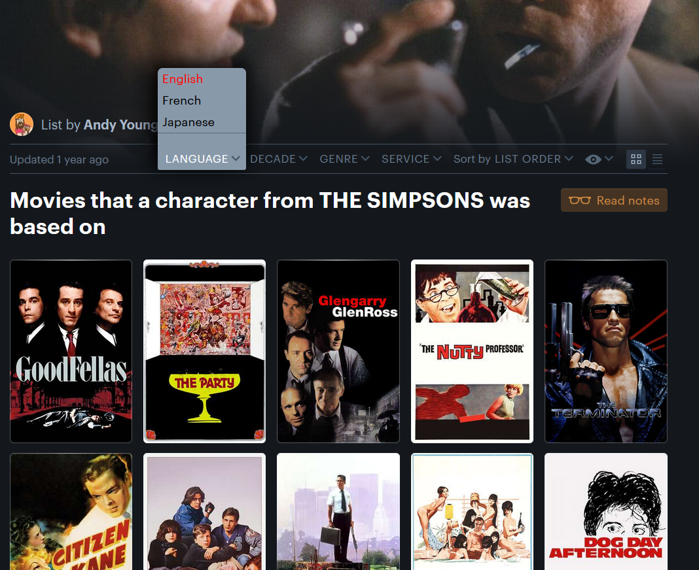
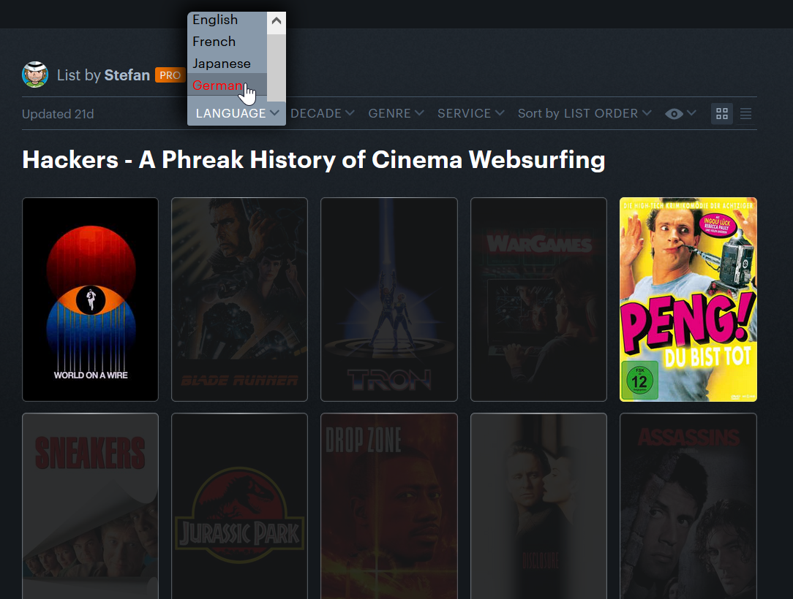

# Letterboxd Languages - Firefox Extension

Adds a language filter to lists.

Written in vanilla Javascript. Language data is sourced from TMDB, to display the language option nicely I built an API to convert the two-letter code to their proper counterpart (e.g. "En"->"English").

 Filter all but English  Filter all but German

## Technologies

- Javascript
- [Language ISO-Code API](https://github.com/ElliotRichard/language-api)
- [Letterboxd](https://letterboxd.com)
- [TMDB API](https://www.themoviedb.org/documentation/api)
